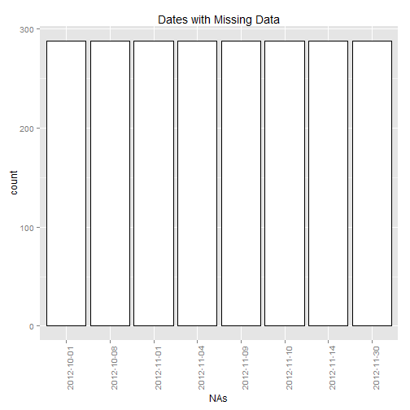
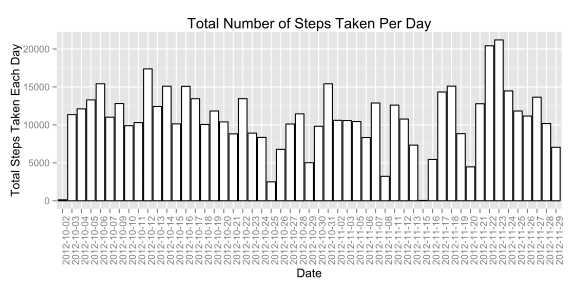
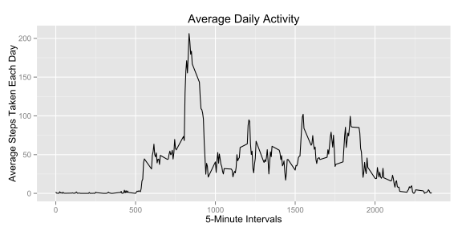
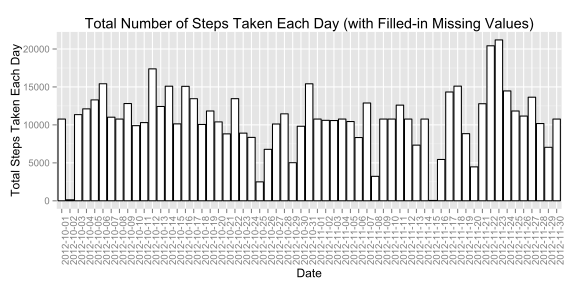
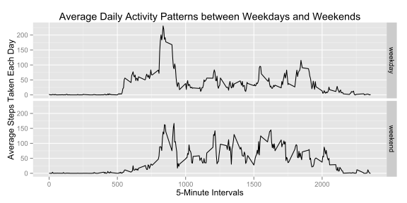

## Runtime Environment Setup


```r
    # function : check if package is installed
    is.installed <- function(mypkg){
        is.element(mypkg, installed.packages()[,1])
    } 

    # install "downloader" package if not installed
    if (!is.installed("downloader")){
        install.packages("downloader")
    }

    # install "ggplot2" package if not installed
    if (!is.installed("ggplot2")){
       install.packages("ggplot2")
    }

    # load required libraries
    library(downloader)
    library(ggplot2)
    library(knitr)
```


## Data Processing

### Download and Read Data from Data Source

The activity.zip file is downloaded from Roger D. Peng's github on 12 December 2014.


```r
    download("https://github.com/rdpeng/RepData_PeerAssessment1/raw/master/activity.zip", "activity.zip")
    
    # unzip dataset into data folder
    unzip("activity.zip", overwrite = FALSE)
```

```
## Warning in unzip("activity.zip", overwrite = FALSE): not overwriting file
## './activity.csv
```

```r
    raw.data <- read.csv("activity.csv")
```

### Basic Data Analysis


```r
    str(raw.data)
```

```
## 'data.frame':	17568 obs. of  3 variables:
##  $ steps   : int  NA NA NA NA NA NA NA NA NA NA ...
##  $ date    : Factor w/ 61 levels "2012-10-01","2012-10-02",..: 1 1 1 1 1 1 1 1 1 1 ...
##  $ interval: int  0 5 10 15 20 25 30 35 40 45 ...
```

```r
    summary(raw.data)
```

```
##      steps                date          interval     
##  Min.   :  0.00   2012-10-01:  288   Min.   :   0.0  
##  1st Qu.:  0.00   2012-10-02:  288   1st Qu.: 588.8  
##  Median :  0.00   2012-10-03:  288   Median :1177.5  
##  Mean   : 37.38   2012-10-04:  288   Mean   :1177.5  
##  3rd Qu.: 12.00   2012-10-05:  288   3rd Qu.:1766.2  
##  Max.   :806.00   2012-10-06:  288   Max.   :2355.0  
##  NA's   :2304     (Other)   :15840
```

```r
    nrow <- nrow(raw.data)
    ncol <- ncol(raw.data)
    n.NA <- sum(is.na(raw.data$steps))

    na.list <- raw.data[is.na(raw.data$steps),]
    NAs <- as.vector(as.character(na.list$date))
    g <- ggplot(data.frame(NAs), aes(x=NAs))
    g + geom_histogram(binwidth=1,colour="black", fill="white") +
        theme(axis.text.x=element_text(angle=90)) +
        ggtitle("Dates with Missing Data")
```

 

A basic analysis of the data was performed and below are the findings:

1.  The structure and a summmary statistics of the new dataset is presented. There are **17568** observations and **3** variables.
2.  It is observed that there are **2304** of observations in the **steps** variable. The dates with NAs are plotted in the above histogram.
    

## What is mean total number of steps taken per day?


```r
    # compute total steps for each day
    steps.per.day <- aggregate(raw.data$steps, by=list(raw.data$date), FUN=sum)
    
    # transform each step into one observation
    names(steps.per.day) <- c("date", "total")
    valid.steps.per.day <- na.omit(steps.per.day)
    steps <- as.vector(rep(as.character(valid.steps.per.day$date), valid.steps.per.day$total))

    # plot a histogram of the total number of steps taken each day 
    g <- ggplot(data.frame(steps), aes(x=steps))
    p <- g + geom_histogram(binwidth=1,colour="black", fill="white") +
        theme(axis.text.x=element_text(angle=90)) +
        labs(x="Date", y= "Total Steps Taken Each Day") +
        ggtitle("Total Number of Steps Taken Per Day")

    # compute mean number of steps taken per day
    mean.steps <- round(mean(steps.per.day$total, na.rm=TRUE),digits=2)

    # compute median number of steps taken per day
    median.steps <- round(median(steps.per.day$total, na.rm=TRUE),digits=2)
```

1.  The number of steps taken daily by the subject are plotted in the histogram below. 


```r
    print(p)    
```

 

2.  The subject took a mean of **1.076619 &times; 10<sup>4</sup>** and a median of **1.0765 &times; 10<sup>4</sup>** steps per day.

## What is the average daily activity pattern?
    

```r
    # compute the mean total steps for all intervals 
    steps.interval <- aggregate(raw.data$steps, by=list(raw.data$interval), FUN=mean, na.rm=TRUE)

    # create a time-series plot of the average daily activity
    names(steps.interval) <- c("interval", "average")
    g <- ggplot(steps.interval, aes(interval, average))
    p <- g + geom_path(colour = "black") +
        labs (x="5-Minute Intervals", y= "Average Steps Taken Each Day") +
        ggtitle("Average Daily Activity")

    # interval with maximum steps
    max.interval <- steps.interval[which.max(steps.interval$average),]
    # maximim average steps
    max.interval$average <- round(max.interval$average)
```

1.  The average number of steps taken in 5-minute interval, averaged across all days are plotted in the histogram below. 


```r
    print(p)    
```

 

2.  The **835<sup>th</sup>** interval has the maximum **206** average number of steps.

## Imputing missing values


```r
    number.NA <- sum(is.na(raw.data$steps))
```

1.  The total of missing values in the dataset is **2304**.

2.  The strategy to fill in missing values is using average steps for an interval to fill into the same interval with missing values.


```r
    fill.data <- raw.data
    for (idx in 1:nrow(raw.data)){
        if (is.na(raw.data$steps[idx])){
            fill.data$steps[idx] <- steps.interval$average[steps.interval$interval==raw.data$interval[idx]]
        }
    }
```

3.  A new dataset is equal to the original dataset but with the missing data filled in. The structure and a summmary statistics of the new dataset is presented.


```r
    str(fill.data)
```

```
## 'data.frame':	17568 obs. of  3 variables:
##  $ steps   : num  1.717 0.3396 0.1321 0.1509 0.0755 ...
##  $ date    : Factor w/ 61 levels "2012-10-01","2012-10-02",..: 1 1 1 1 1 1 1 1 1 1 ...
##  $ interval: int  0 5 10 15 20 25 30 35 40 45 ...
```

```r
    summary (fill.data)
```

```
##      steps                date          interval     
##  Min.   :  0.00   2012-10-01:  288   Min.   :   0.0  
##  1st Qu.:  0.00   2012-10-02:  288   1st Qu.: 588.8  
##  Median :  0.00   2012-10-03:  288   Median :1177.5  
##  Mean   : 37.38   2012-10-04:  288   Mean   :1177.5  
##  3rd Qu.: 27.00   2012-10-05:  288   3rd Qu.:1766.2  
##  Max.   :806.00   2012-10-06:  288   Max.   :2355.0  
##                   (Other)   :15840
```


```r
    any.NA <- as.numeric(any(is.na(fill.data)))
```

There are **0** NA values in the new dataset.

4.  Using the new dataset, a histogram of the total number of steps taken each day is displayed below.


```r
    # compute total steps for each day
    steps.per.day.without.NA <- aggregate(fill.data$steps, by=list(fill.data$date), FUN=sum)
    
    # transform into each step is one observation
    names(steps.per.day.without.NA) <- c("date", "total")
    steps.without.NA <- as.vector(rep(as.character(steps.per.day.without.NA$date), steps.per.day.without.NA$total))

    # make a histogram of the total number of steps taken each day 
    g <- ggplot(data.frame(steps.without.NA), aes(x=steps.without.NA))
    p <- g + geom_histogram(binwidth=1,colour="black", fill="white") +
        theme(axis.text.x=element_text(angle=90)) +
        labs(x="Date", y= "Total Steps Taken Each Day") +
        ggtitle("Total Number of Steps Taken Each Day (with Filled-in Missing Values)")
```


```r
    print(p)
```

 

Calculate the mean and median total number of steps taken per day.


```r
    # compute mean number of steps taken per day
    mean.steps.without.NA <- round(mean(steps.per.day.without.NA$total, na.rm=TRUE),2)
    
    # compute median number of steps taken per day
    median.steps.without.NA <- round(median(steps.per.day.without.NA$total, na.rm=TRUE),2)
```

The mean is **1.076619 &times; 10<sup>4</sup>** and median is **1.076619 &times; 10<sup>4</sup>**.

## Are there differences in activity patterns between weekdays and weekends?

###Do these values differ from the estimates from the first part of the assignment?

* Mean and median of dataset with NA removed.

    1. Mean : **1.076619 &times; 10<sup>4</sup>**.
    2. Median : **1.0765 &times; 10<sup>4</sup>**.


* Mean and median of dataset replacing NAs observation with mean daily value of an interval.

    1. Mean : **1.076619 &times; 10<sup>4</sup>**.
    2. Median : **1.076619 &times; 10<sup>4</sup>**.


No, there are minor differences between the Medians and no difference between the Means.

###What is the impact of imputing missing data on the estimates of the total daily number of steps?

There is no impact since the 2 set of Means and Medians do not differ. This shows that the strategy applied on filling in missing values does not impact the overall statistical distribution of total number of steps taken each day.

## Are there differences in activity patterns between weekdays and weekends?


```r
    # function which based on date to determine a weekday or weekend
    dayofwk <- function (date){
        day <- weekdays(as.Date(date))
        
        if (day == "Sunday" || day == "Saturday"){
            return ("weekend")
        } 
        else {
            return ("weekday")
        }
    }
    
    # create a character vector of weekday or weekend that corresponds to dates in the 
    # filled-in missing values dataset.
    day.type <- sapply (fill.data$date, dayofwk)
    
    # create a new variable day.type
    fill.data$day.type <- as.factor(day.type)
```


```r
    # compute the average number of steps taken, averaged across all weekday days or weekend days 
    steps.day.type <- aggregate(fill.data$steps, by=list(fill.data$interval, fill.data$day.type), FUN=mean)
    names(steps.day.type) <- c("interval", "dayofwk", "average")

    # create a time-series plot of the average daily activity
    g <- ggplot(data.frame(steps.day.type), aes(x=interval, y=average))
    p <- g + geom_line() +
        facet_grid(dayofwk ~ .) +
        labs (x="5-Minute Intervals", y="Average Steps Taken Each Day") +
        ggtitle("Average Daily Activity Patterns between Weekdays and Weekends")
```


```r
    print(p)
```

 

In general, the subject takes more steps on weekends as compared on weekdays. It is also noted that the subject is particular active at a particular time of day.  
